# 2026 年数据谱系

> 本页由 `scripts/python/version_lineage.py build-docs` 生成。图中的节点代表逻辑 artifact；数据本体不进入 Git。

```mermaid
flowchart LR
  n_analysis_v3bpath_ready_dta["analysis-v3bpath-ready-dta\npresent"]
  n_analysis_v3decomp_ready_dta["analysis-v3decomp-ready-dta\npresent"]
  n_analysis_v3med_ready_dta["analysis-v3med-ready-dta\npresent"]
  n_analysis_v3prhd_ready_dta["analysis-v3prhd-ready-dta\npresent"]
  n_analysis_v3prhdsm_ready_dta["analysis-v3prhdsm-ready-dta\npresent"]
  n_analysis_v3proxy_ready_dta["analysis-v3proxy-ready-dta\npresent"]
  n_analysis_v3sub_ready_dta["analysis-v3sub-ready-dta\npresent"]
  n_compound_event_precip_aligned_series["compound-event-precip-aligned-series\npresent"]
  n_compound_event_smoke_panel_v2["compound-event-smoke-panel-v2\npresent"]
  n_compound_event_smrz_aligned_series["compound-event-smrz-aligned-series\npresent"]
  n_compound_event_tmax_aligned_series["compound-event-tmax-aligned-series\npresent"]
  n_data_v1_county_city["data-v1-county-city\npresent"]
  n_data_v1_locked_panel["data-v1-locked-panel\npresent"]
  n_data_v1_master["data-v1-master\npresent"]
  n_data_v2_analysis_ready["data-v2-analysis-ready\npresent"]
  n_data_v2_main_corrected_missing["data-v2-main-corrected-missing\nmissing"]
  n_data_v2_main_initial_missing["data-v2-main-initial-missing\nmissing"]
  n_data_v3_analysis_ready["data-v3-analysis-ready\npresent"]
  n_data_v3_expanded_main["data-v3-expanded-main\npresent"]
  n_data_v3_expanded_main_dta["data-v3-expanded-main-dta\npresent"]
  n_data_v3_expanded_noyield["data-v3-expanded-noyield\npresent"]
  n_data_v3_expanded_phenowindows["data-v3-expanded-phenowindows\npresent"]
  n_data_v3_expanded_phenowindows_dta["data-v3-expanded-phenowindows-dta\npresent"]
  n_g049_virtual_sample["g049-virtual-sample\nvirtual"]
  n_g057_virtual_sample["g057-virtual-sample\nvirtual"]
  n_g185_virtual_sample["g185-virtual-sample\nvirtual"]
  n_g195_b067_virtual_sample["g195-b067-virtual-sample\nvirtual"]
  n_ggcp10_aggregated_base["ggcp10-aggregated-base\npresent"]
  n_ggcp10_aggregated_sidecar["ggcp10-aggregated-sidecar\npresent"]
  n_ggcp10_baseline_suite["ggcp10-baseline-suite\npresent"]
  n_ggcp10_point_base["ggcp10-point-base\npresent"]
  n_ggcp10_point_v6_base["ggcp10-point-v6-base\npresent"]
  n_ggcp10_raw_harvarea_raster_series["ggcp10-raw-harvarea-raster-series\npresent"]
  n_mechanism_sm_state_wide_april_missing["mechanism-sm-state-wide-april-missing\nmissing"]
  n_mechanism_sm_state_wide_current["mechanism-sm-state-wide-current\npresent"]
  n_mechanism_v5drymed_ready_dta["mechanism-v5drymed-ready-dta\npresent"]
  n_regional_threshold_grid_v1["regional-threshold-grid-v1\npresent"]
  n_regional_threshold_maize_raster["regional-threshold-maize-raster\npresent"]
  n_data_v1_master -->|v1-add-county-city| n_data_v1_county_city
  n_data_v1_county_city -->|v1-phase0-lock| n_data_v1_locked_panel
  n_data_v1_master -->|v2-initial-climate-pipeline| n_data_v2_main_initial_missing
  n_data_v2_main_initial_missing -->|v2-spei-terminal-month-correction| n_data_v2_main_corrected_missing
  n_data_v2_main_initial_missing -->|v2-analysis-preamble| n_data_v2_analysis_ready
  n_data_v2_main_corrected_missing -->|v3-corrected-analysis-preamble| n_data_v3_analysis_ready
  n_data_v1_locked_panel -->|v3-expanded-multisource-pipeline| n_data_v3_expanded_phenowindows
  n_data_v3_expanded_phenowindows -->|v3-export-yield-present| n_data_v3_expanded_main
  n_data_v3_expanded_phenowindows -->|v3-export-yield-missing| n_data_v3_expanded_noyield
  n_data_v3_expanded_phenowindows -->|v3-export-phenowindows-stata| n_data_v3_expanded_phenowindows_dta
  n_data_v3_expanded_main -->|v3-export-main-stata| n_data_v3_expanded_main_dta
  n_data_v3_expanded_main_dta -->|v3-precipitation-hotdry-preamble| n_analysis_v3prhd_ready_dta
  n_data_v3_expanded_main_dta -->|v3-multisource-sm-preamble| n_analysis_v3prhdsm_ready_dta
  n_data_v3_analysis_ready -->|v3-decomposition-profiles| n_analysis_v3decomp_ready_dta
  n_data_v3_analysis_ready -->|v3-subsample-tags| n_analysis_v3sub_ready_dta
  n_data_v3_analysis_ready -->|v3-model8-preparation| n_analysis_v3med_ready_dta
  n_analysis_v3prhdsm_ready_dta -->|v3-sm-proxy-preparation| n_analysis_v3proxy_ready_dta
  n_analysis_v3prhdsm_ready_dta -->|v3-bpath-base| n_analysis_v3bpath_ready_dta
  n_data_v3_analysis_ready -->|v3-bpath-wet-control-merge| n_analysis_v3bpath_ready_dta
  n_data_v3_analysis_ready -->|v5-drought-mediator-base| n_mechanism_v5drymed_ready_dta
  n_analysis_v3sub_ready_dta -->|v5-region-tag-merge| n_mechanism_v5drymed_ready_dta
  n_mechanism_sm_state_wide_april_missing -->|v5-state-mediator-merge| n_mechanism_v5drymed_ready_dta
  n_data_v3_expanded_phenowindows_dta -->|v4-state-variable-build| n_mechanism_sm_state_wide_current
  n_ggcp10_raw_harvarea_raster_series -->|ggcp10-point-sample| n_ggcp10_point_base
  n_data_v3_analysis_ready -->|ggcp10-point-base-merge| n_ggcp10_point_base
  n_data_v1_county_city -->|ggcp10-point-production-merge| n_ggcp10_point_base
  n_ggcp10_point_base -->|ggcp10-point-v6-gleam| n_ggcp10_point_v6_base
  n_ggcp10_raw_harvarea_raster_series -->|ggcp10-area-preserving-aggregate| n_ggcp10_aggregated_sidecar
  n_ggcp10_aggregated_sidecar -->|ggcp10-aggregated-area-merge| n_ggcp10_aggregated_base
  n_data_v3_analysis_ready -->|ggcp10-aggregated-base-merge| n_ggcp10_aggregated_base
  n_data_v1_county_city -->|ggcp10-aggregated-production-merge| n_ggcp10_aggregated_base
  n_ggcp10_aggregated_base -->|ggcp10-baseline-suite-build| n_ggcp10_baseline_suite
  n_ggcp10_baseline_suite -->|g185-base-filter| n_g185_virtual_sample
  n_data_v3_expanded_main_dta -->|g185-hotdry-merge| n_g185_virtual_sample
  n_ggcp10_baseline_suite -->|g057-base-filter| n_g057_virtual_sample
  n_ggcp10_baseline_suite -->|g049-base-filter| n_g049_virtual_sample
  n_ggcp10_baseline_suite -->|g195-b067-equivalent-filter| n_g195_b067_virtual_sample
  n_data_v3_expanded_main_dta -->|regional-threshold-grid-coordinate-base| n_regional_threshold_grid_v1
  n_regional_threshold_maize_raster -->|regional-threshold-containing-cell-map| n_regional_threshold_grid_v1
  n_data_v3_expanded_main_dta -->|compound-event-smoke-sample-and-window| n_compound_event_smoke_panel_v2
  n_compound_event_tmax_aligned_series -->|compound-event-tmax-index| n_compound_event_smoke_panel_v2
  n_compound_event_precip_aligned_series -->|compound-event-precip-index| n_compound_event_smoke_panel_v2
  n_compound_event_smrz_aligned_series -->|compound-event-smrz-channel-index| n_compound_event_smoke_panel_v2
```

## 转换登记

| Edge | 输入 | 输出 | 代码 | 过滤或重定义 | 验证状态 |
|---|---|---|---|---|---|
| edge-0001 | data-v1-master | data-v1-county-city | repo://scripts/python/add_county_city_from_coords.py | none; unchanged | three-source-confirmed |
| edge-0002 | data-v1-county-city | data-v1-locked-panel | repo://scripts/stata/step0_sample_and_macros.do | no row filter; creates main_sample; unchanged | three-source-confirmed |
| edge-0003 | data-v1-master | data-v2-main-initial-missing | repo://data_build/scripts/python/run_all.py | retain V1 yield-present panel; unchanged | missing-snapshot |
| edge-0004 | data-v2-main-initial-missing | data-v2-main-corrected-missing | repo://data_build/scripts/python/s06_calc_vpd_spei.py | replace overlapping-window SPEI means with terminal-month SPEI at dynamic scale; unchanged | missing-snapshot |
| edge-0005 | data-v2-main-initial-missing | data-v2-analysis-ready | repo://scripts/stata/v2_step0_preamble.do | no row filter; creates main_sample; unchanged | two-source-supported |
| edge-0006 | data-v2-main-corrected-missing | data-v3-analysis-ready | repo://scripts/stata/v3_step0_preamble.do | no row filter; creates main_sample and analysis aliases; unchanged | two-source-supported |
| edge-0007 | data-v1-locked-panel | data-v3-expanded-phenowindows | repo://data_build/scripts/python/run_all.py | none; unchanged | two-source-supported |
| edge-0008 | data-v3-expanded-phenowindows | data-v3-expanded-main | repo://data_build/scripts/python/s10_export.py | yield_tons_ha is not missing; unchanged | three-source-confirmed |
| edge-0009 | data-v3-expanded-phenowindows | data-v3-expanded-noyield | repo://data_build/scripts/python/s10_export.py | yield_tons_ha is missing; unchanged | three-source-confirmed |
| edge-0010 | data-v3-expanded-phenowindows | data-v3-expanded-phenowindows-dta | repo://data_build/scripts/python/s10_export.py | none; unchanged | three-source-confirmed |
| edge-0011 | data-v3-expanded-main | data-v3-expanded-main-dta | repo://data_build/scripts/python/s10_export.py | none; unchanged | three-source-confirmed |
| edge-0012 | data-v3-expanded-main-dta | analysis-v3prhd-ready-dta | repo://scripts/stata/v3prhd_step0_preamble.do | no row filter; creates analysis flags and aliases; unchanged | three-source-confirmed |
| edge-0013 | data-v3-expanded-main-dta | analysis-v3prhdsm-ready-dta | repo://scripts/stata/v3prhdsm_step0_preamble.do | no row filter; creates multisource SM flags and aliases; unchanged | three-source-confirmed |
| edge-0014 | data-v3-analysis-ready | analysis-v3decomp-ready-dta | repo://scripts/stata/v3decomp_step0_profiles.do | no row filter; creates common-sample flags and profile constants; unchanged | three-source-confirmed |
| edge-0015 | data-v3-analysis-ready | analysis-v3sub-ready-dta | repo://scripts/stata/v3sub_step0_subsamples.do | no row filter; creates maize_zone and irrigation/subsample tags; unchanged | three-source-confirmed |
| edge-0016 | data-v3-analysis-ready | analysis-v3med-ready-dta | repo://scripts/stata/v3med_step0_preamble.do | no row filter; creates common-sample flags; unchanged | three-source-confirmed |
| edge-0017 | analysis-v3prhdsm-ready-dta | analysis-v3proxy-ready-dta | repo://scripts/stata/v3proxy_step0_preamble.do | no row filter; creates one common-support flag and DrySM proxies; unchanged | three-source-confirmed |
| edge-0018 | analysis-v3prhdsm-ready-dta | analysis-v3bpath-ready-dta | repo://scripts/stata/v3bpath_step0_preamble.do | keep master and matched; unchanged | three-source-confirmed |
| edge-0019 | data-v3-analysis-ready | analysis-v3bpath-ready-dta | repo://scripts/stata/v3bpath_step0_preamble.do | keep matched W_* fields; unchanged | three-source-confirmed |
| edge-0020 | data-v3-analysis-ready | mechanism-v5drymed-ready-dta | repo://scripts/stata/v5drymed_step0_preamble.do | keep master and matched; unchanged | two-source-supported |
| edge-0021 | analysis-v3sub-ready-dta | mechanism-v5drymed-ready-dta | repo://scripts/stata/v5drymed_step0_preamble.do | keep maize_zone and irr_group; unchanged | three-source-confirmed |
| edge-0022 | mechanism-sm-state-wide-april-missing | mechanism-v5drymed-ready-dta | repo://scripts/stata/v5drymed_step0_preamble.do | keep dry-state mediator fields; unchanged | missing-snapshot |
| edge-0023 | data-v3-expanded-phenowindows-dta | mechanism-sm-state-wide-current | repo://scripts/python/v4smstate_build_statevars.py | none; unchanged | two-source-supported |
| edge-0024 | ggcp10-raw-harvarea-raster-series | ggcp10-point-base | repo://scripts/python/ggcp10_build_harvarea_branch.py | 2016-2019; yield_tons_ha=(maize_prod/ggcp10_maize_area_km2)*10; ln_yield=ln(yield_tons_ha) | three-source-confirmed |
| edge-0025 | data-v3-analysis-ready | ggcp10-point-base | repo://scripts/python/ggcp10_build_harvarea_branch.py | retain all 69038 base rows; yield_tons_ha=(maize_prod/ggcp10_maize_area_km2)*10 | three-source-confirmed |
| edge-0026 | data-v1-county-city | ggcp10-point-base | repo://scripts/python/ggcp10_build_harvarea_branch.py | maize_prod must match; yield_tons_ha=(maize_prod/ggcp10_maize_area_km2)*10 | three-source-confirmed |
| edge-0027 | ggcp10-point-base | ggcp10-point-v6-base | repo://scripts/stata/v6gleambl_harvarea_run_all.do | retain base rows; unchanged | three-source-confirmed |
| edge-0028 | ggcp10-raw-harvarea-raster-series | ggcp10-aggregated-sidecar | repo://scripts/python/ggcp10_build_harvarea_agg_branch.py | 2016-2019; none | three-source-confirmed |
| edge-0029 | ggcp10-aggregated-sidecar | ggcp10-aggregated-base | repo://scripts/python/ggcp10_build_harvarea_agg_branch.py | retain all 69038 base rows; yield_tons_ha=(maize_prod/ggcp10_maize_area_km2)*10; ln_yield=ln(yield_tons_ha) | three-source-confirmed |
| edge-0030 | data-v3-analysis-ready | ggcp10-aggregated-base | repo://scripts/python/ggcp10_build_harvarea_agg_branch.py | retain all base rows; yield_tons_ha=(maize_prod/ggcp10_maize_area_km2)*10 | three-source-confirmed |
| edge-0031 | data-v1-county-city | ggcp10-aggregated-base | repo://scripts/python/ggcp10_build_harvarea_agg_branch.py | maize_prod must match; yield_tons_ha=(maize_prod/ggcp10_maize_area_km2)*10 | three-source-confirmed |
| edge-0032 | ggcp10-aggregated-base | ggcp10-baseline-suite | repo://scripts/stata/ggcp10_baseline_suite_run_all.do | retain all base rows; unchanged | three-source-confirmed |
| edge-0033 | ggcp10-baseline-suite | g185-virtual-sample | repo://scripts/python/expanded_scale_story_search.py | ggcp10_maize_frac>=0.05 and main_sample=1 and yield_domain=1 and yield_jump=1 and sm_sd=1; unchanged | three-source-confirmed |
| edge-0034 | data-v3-expanded-main-dta | g185-virtual-sample | repo://scripts/python/ggcp10_parallel_rules_69038_search.py | same G185 mask after merge; unchanged | three-source-confirmed |
| edge-0035 | ggcp10-baseline-suite | g057-virtual-sample | repo://scripts/python/expanded_scale_story_search.py | ggcp10_maize_frac>=0.05 and yield_domain=1 and yield_jump=1 and sm_sd=1; unchanged | three-source-confirmed |
| edge-0036 | ggcp10-baseline-suite | g049-virtual-sample | repo://scripts/python/expanded_scale_story_search.py | ggcp10_maize_frac>=0.05 and yield_domain=1 and yield_jump=1; unchanged | three-source-confirmed |
| edge-0037 | ggcp10-baseline-suite | g195-b067-virtual-sample | repo://scripts/python/expanded_scale_story_search.py | ggcp10_maize_frac>=0.05 and main_sample=1 and zone_core=1 and sr_within=1; unchanged | three-source-confirmed |
| edge-0038 | data-v3-expanded-main-dta | regional-threshold-grid-v1 | repo://scripts/python/audit_regional_threshold_coverage.py | retain one coordinate record per V3 grid; not_applicable | three-source-confirmed |
| edge-0039 | regional-threshold-maize-raster | regional-threshold-grid-v1 | repo://scripts/python/audit_regional_threshold_coverage.py | no interpolation, extrapolation or NoData filling; not_applicable | three-source-confirmed |
| edge-0040 | data-v3-expanded-main-dta | compound-event-smoke-panel-v2 | repo://scripts/python/run_hotdry_event_stage1.py | first two eligible grid-year rows per named zone-year; interface only; unchanged | three-source-confirmed |
| edge-0041 | compound-event-tmax-aligned-series | compound-event-smoke-panel-v2 | repo://scripts/python/run_hotdry_event_stage1.py | Tmax>=32C candidate days within the frozen window; not_applicable | three-source-confirmed |
| edge-0042 | compound-event-precip-aligned-series | compound-event-smoke-panel-v2 | repo://scripts/python/run_hotdry_event_stage1.py | precipitation<1 mm/day candidate days within the frozen window; not_applicable | three-source-confirmed |
| edge-0043 | compound-event-smrz-aligned-series | compound-event-smoke-panel-v2 | repo://scripts/python/run_hotdry_event_stage1.py | onset-14 through onset-1 antecedent and event-to-censor recovery windows; not_applicable | three-source-confirmed |
